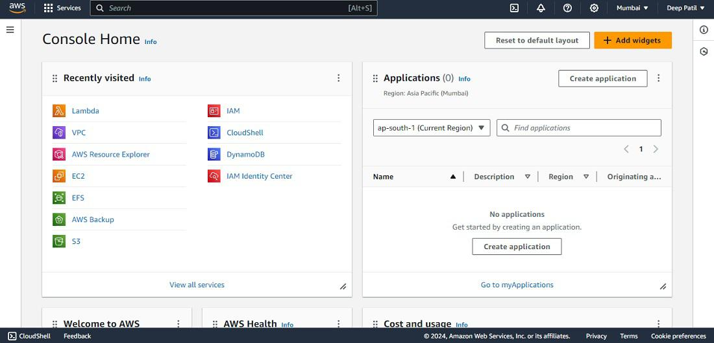

# 🚀 DevOps Learning Environment Setup

Welcome to my first DevOps mini-project! This repository documents how I set up a basic DevOps environment using VirtualBox, Ubuntu, Visual Studio Code, GitHub, and AWS.

---

## 📸 Screenshots and Setup Walkthrough

### 1. 🖥️ Visual Studio Code Installation & Setup

I installed Visual Studio Code and configured it for development.   
Below is the screenshot of my Visual Studio Code setup:


---

### 2. 📦 VirtualBox Installation Confirmation

I installed Oracle VirtualBox to create a virtualized environment.  
Here is the confirmation screenshot showing the VirtualBox Manager welcome screen:


---

### 3. 🐧 Ubuntu Installation on VirtualBox

I downloaded Ubuntu (20.04 LTS), created a virtual machine in VirtualBox, and installed Ubuntu.  
Below is the screenshot showing the Ubuntu login prompt inside VirtualBox, confirming a successful installation:


---

### 4. 🐙 Git Installation Confirmation

I installed Git and verified it by running `git --version` in the terminal.  
Here is the terminal output confirming the Git installation:


---

### 5. 🐙 GitHub Account Setup

I created and configured my GitHub account.  
This included generating SSH keys, connecting Git to GitHub, and initializing my project repo.  
Here is a screenshot of the GitHub dashboard:


---

### 6. ☁️ AWS Management Console Setup

I signed up for AWS Free Tier and set up the AWS Management Console.  
I explored key services such as EC2, IAM, and S3.  
Below is the screenshot of the AWS Console homepage:



---

## 🔼 How I Pushed This Project to GitHub

Here are the steps I used to push this repository to GitHub using Git:

```bash
git init
git add .
git commit -m "Initial commit with setup screenshots"
git push

## 🛠 Technologies & Tools Used

- Visual Studio Code
- Ubuntu 20.04 LTS (via VirtualBox)
- Git & GitHub
- AWS Free Tier

---

## 🏷️ Tags

DevOps, VirtualBox, Ubuntu, GitHub, AWS, Visual Studio Code, First Project, Setup Walkthrough

---

## 🙌 Acknowledgment

Thanks to everyone who made this learning experience possible.  
This marks the beginning of my DevOps journey.
