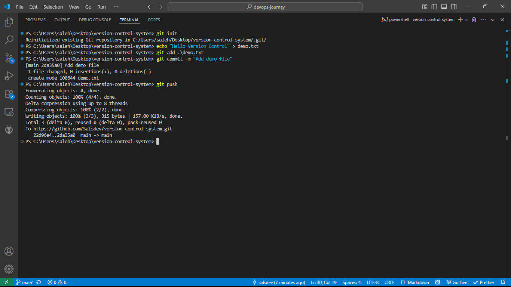

# Version Control System (VCS) – Practical Demonstration

## 📌 Overview

A **Version Control System (VCS)** is a tool that helps developers track, manage, and collaborate on code changes over time. Git is the most popular VCS used today, allowing both individuals and teams to work efficiently.

This document provides a basic introduction to Git and a practical walkthrough with screenshots and GitHub usage.

---

## ✅ Why is Version Control Needed?

- **Collaboration**: Multiple developers can work on the same project simultaneously.
- **History Tracking**: See what changes were made, by whom, and when.
- **Backup & Restore**: Revert to earlier versions when needed.
- **Branching**: Experiment or add features without affecting the main project.
- **Conflict Resolution**: Helps identify and resolve code conflicts.

---

## 🔧 Git Commands Used (CLI)

Here is a list of basic Git commands used in this project:

```bash
# Initialize a new Git repository
git init

# Create a file
echo "Hello Version Control" > demo.txt

# Stage the file for commit
git add demo.txt

# Commit the file with a message
git commit -m "Initial commit with demo file"

# Add a remote GitHub repository
git remote add origin https://github.com/Saalsdev/version-control-demo.git

# Rename the branch to main
git branch -M main

# Push the code to GitHub
git push -u origin main


